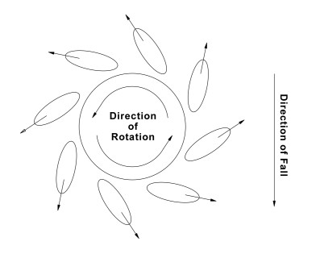
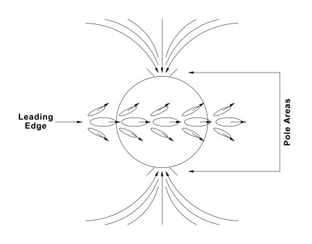
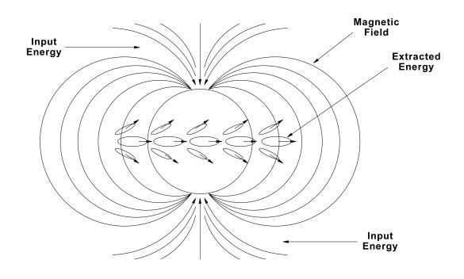
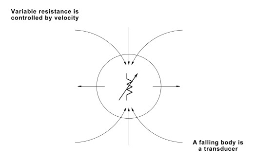
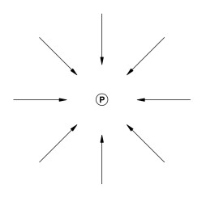
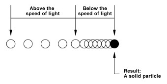
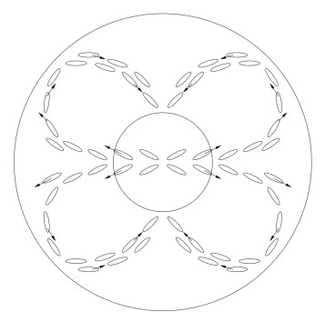
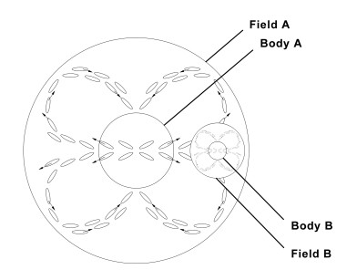

**INTRODUCTION TO THEORY**  
  
Our purpose here is not to write a textbook on physics, but rather to present this theory in its simplest form, so it may be understood by layman and physicist alike. We will make no attempt to appease the scientific community in this presentation, as we know from long experience that they will reject the evidence of their own eyes, if that evidence should challenge what they have accepted as physical "law". In other words then, this paper will simply explain what is happening in our physical world and why. All of the mathematical calculations that go with the theory will be left for another, more appropriate time.  
  
We will begin this discussion by stating that the force which unifies all things is motion, for without motion there is nothing, and we will then show the dynamics of a body in motion (falling body). From there we will enter into brief discussions on energy to mass conversion, mass to energy conversion, anti-matter, and will summarize with a short explanation of the equation which unifies all things, i.e., mass, energy and forces.  
  
It is not an easy task to relearn physics, we know, but this theory has been tested and is correct, so it is well worth the effort to study this material carefully. If what is being said is comprehended, the reader should be able to begin to apply the information to the earth in general, and to what is happening to the ionosphere in particular. Once atomic structure has been explained, the reader will also begin to see how, using technologies based on correct physics, we can repair the damage and place this planet back into its proper balance - if we work together.  
  
# [UNITY OF ALL THINGS](#unity-of-all-things) {#unity-of-all-things}
  
**THEORY**  
  
We have already stated that motion is the catalyst by which all else exists. For this reason we refer to motion as the creative force. We will now further state that the four forces that have been identified by the scientific community are in reality one force in four of its different actions. This force manifests itself in different actions based on predictable conditions and its stage in a repetitious, wonderfully simple cycle called nature. Currently due to the work of Fischbach and Aronson, the scientific community is speculating that perhaps all bodies do not accelerate at the same rate, but instead of backing up and questioning existing "law", these scientists are now busy hypothesizing that there is yet another force, which they have tentatively named hypercharge. We know this is not correct! What they have stumbled upon is in fact no more than the unified force displaying its repulsive action. Our generic term for the unified force is neutral energy, and we will now attempt to show how it manifests itself in the physical world.  
  
# [FALLING BODIES](#falling-bodies) {#falling-bodies}
  
For the purposes of this paper, the term falling body is defined as any body which moves, or "falls" through a gravitational field. This includes all sub-atomic particles, solar systems, galaxies, universes, universal vortexes, and yet greater expanses. As indicated in our tests and illustrated below, a falling body produces about itself a force of extracted energy.  
  

Fig. 14  
  
This extracted energy attempts to return to the body it's been extracted from. As shown in figure 14, this cycle produces a force around the body. The result is a gravitational field which will be felt as an attracting force by anything which exists within that field. As the arrows indicate, however, any body or thing which exists outside of this field will be pushed away (or repulsed) from the body. It must be understood - that which is generically referred to as gravity is not always an attracting force.  
  
The major line of extraction of energy from a falling body is at the leading edge of the fall of that body, as illustrated in figure 15.  
  

Fig. 15  
  
As has been indicated, the extracted energy attempts to return to the body it has been extracted from, however, motion at the rate of velocity squared will not allow this energy to return to the body. This pressure or "pull" is felt by the body, causing it to rotate in the direction of the energy extraction, as shown below.  
  

Fig. 16  
  
Size, velocity, composition of the body, and the value of the gravitational field the body falls through are all major factors in the rate of the rotation. For instance, the larger the body, the faster the rotation, and the greater the velocity of the body the faster it will rotate. Also, a falling body composed of steel will rotate faster than an equal sized body of carbon, the reasons for which will be discussed in greater depth in the segment on atomic structure.  

  
> [!NOTE]
> Missing Section: (one page of the typed manuscript, is lost, along with figure 17)

  
The energy that's been extracted from the leading edge of a falling body presents an energy void to the body. This energy void is filled by an input of energy 90° from the leading edge of the falling body, as illustrated in figure 18.  
  

Fig. 18  
  
This input energy taken in at the point of rotation (90° from the leading edge) is what is seen as the magnetic poles, indicated below.  
  

Fig. 19  
  
The energy flow into the poles, combined with the extraction of energy at the leading edge of the fall, produces an energy flow which results in a magnetic field, as seen in figure 20.  
  

Fig. 20  
  
A group of bodies which were in formation before the onset of their fall will produce the same results as a single falling body, with a few exceptions. As shown in test three, when multiple bodies fall as a unit, they group themselves into a spherical formation. Having done this, they will produce the same extracted force as does a single body, shown below.  
  

Fig. 21  
  
At the same time, each individual body within this formation develops its own rotation, the rate of which depends upon the body's individual size and the velocity of the mass as a whole.  
  

Fig. 22  
  
As seen above, although these bodies combine their energies and rotate as a single body, each individual still obeys the laws of falling bodies as well, and so creates and maintains its own field, which repulses the fields of the other bodies. This repulsive action results in "space" between the bodies. It should also be noted that such a grouping of bodies falling in tight formation will continuously exchange pole positions, i.e., the north pole becomes the south pole and vice versa.  
  
Stated in simple terms, a falling body is an energy exchanger, or in other words, is a transducer. The energy extracted at the leading edge of the fall is consistently the same value - the same sized bubble. Even so, the poles will accept any energy which may be available, be it neutral energy (bubbles) or polarized energy. The interior of a falling body is quite comparable to a variable resistor. The value of resistance is inversely proportional to the velocity of the body at the rate of velocity squared. To repeat: resistance goes down as the velocity is increased. This is illustrated in figure 23.  
  

Fig. 23  
  
## [ENERGY TO MASS CONVERSION](#energy-to-mass-conversion) {#energy-to-mass-conversion}
  
As indicated, a falling body is a transducer and all bodies are falling. Every body has a value of internal resistance which is inversely proportional to velocity. When a body obtains a velocity of .9 times the speed of light, the internal resistance becomes a negligible factor. The body now accepts greater amounts of energy than it can radiate. This surplus energy now becomes very compact, and the minute bubbles of energy begin to pack together, as shown in figure 24.  
  

Fig. 24  
  
As a result of this compression of bubbles, a particle of mass is formed. Mass is therefore no more than solidified energy. The compression of bubbles illustrated in figure 24 results in a particle, shown below.  
  

Fig. 25  
  
Should a falling body maintain a velocity of between 167,000 and 186,000 miles per second, the conversion from energy to mass would be infinite.  
  
## [MASS TO ENERGY CONVERSION](#mass-to-energy-conversion) {#mass-to-energy-conversion}
  
As a body obtains the velocity of light, the internal resistance becomes zero. Energy continues to be extracted from the body at an accelerated rate. The velocity of the body is equal to, or greater than the velocity of energy. This means energy cannot overtake (or "catch up with") and enter the body. The great pressure (potential) extracts all the energy from the body. The sub-atomic particles begin to "shed" their outermost shells (i.e., bubbles), and this process will continue until no particle remains. All that does remain is a vortex of pure (neutral) energy. The conversion of mass to energy is progressive at the rate of the velocity of light squared.  
  
### [DENSITY OF MASS](#density-of-mass) {#density-of-mass}
  
The density of a given element is directly related to the motion of that mass. A falling body is a transducer, the energy exchange of that transducer is limited by the internal resistance of that body. The value of that resistance is inversely proportional to the velocity of the body. Therefore, as the velocity of motion decreases, the internal resistance increases, and results in a zero value of energy flow. The body now becomes dormant and lies completely condensed - there exists no space, and no life. The force that will give this body life is motion. Should our entire solar system obtain a velocity of zero, it would probably fit into a quart jar.  
  
### [SUB-ATOMIC PARTICLES](#sub-atomic-particles) {#sub-atomic-particles}
  
Minute bubbles of energy, which we call neutral energy, are the building blocks of solid particles. As long as this energy (bubbles) remains at or above the velocity of light, the bubbles remain unattached and independent, however, when the leading edge begins to slow, the trailing bubbles begin to collide with the slowed bubbles. This causes the bubbles to pile up and compact, i.e., some bubbles encase other bubbles, as illustrated in figure 26.  
  

Fig. 26  
  
We therefore state that mass is but solidified energy. Sub-atomic particles vary greatly in size, but they are all created by nature in the same manner, and with the exception of size, weight, and configuration, they are identical. The scientific community speaks of different particles having different charges, but this is a mis-perception, or more precisely, a problem of mis-identification. There are very simple, logical reasons why that which is called an electron has a negative charge, while that which is called a proton has a positive charge, etc., but the explanation is beyond the scope of this paper, and will be discussed in depth in the segment dealing with atomic structure.  
  
## [ANTI-MATTER](#anti-matter) {#anti-matter}
  
The universe in which we exist is falling in a given direction. The velocity of that fall is unknown except for relative motion, however, should the opposite direction be taken, at exactly the same velocity, the true velocity would then be zero. At absolute zero velocity energy becomes a zero factor, so that v = E, thereby, zero velocity equals zero energy. Mass will respond in a like manner - once again, velocity determines the value of energy contained in mass. With a zero value of energy, mass becomes very condensed.  
  
We will now add value to the zero velocity and say that our motion is now in the reciprocal direction. With an increase in velocity, energy is once more generated. Energy (due to motion) is now available, and the dense, compacted particles expand. The bodies are once again transducers, however, everything is reversed - energy is now being radiated from the former poles, while the plane of the leading edge of the fall accepts energy. The falling body is now a negative ion, and particles which orbit this falling body are charged in a positive direction. This universe (or galaxy, solar system, atom, etc.) at this point is what we can call anti-matter.  
  
As the velocity increases to and beyond the speed of light, we once again convert the mass to energy, and that energy is neutral - neutral, that is, in respect to itself. All that remains of that mass is a spiraling vortex of pure energy. More will be explained on this subject when we discuss the birth of a universe.  
  
## [UNITY](#unity) {#unity}
  
We have shown that zero motion results in zero energy and in negligible amounts of mass, and that the direction of motion is all which separates matter from anti-matter. Also, we have shown the factors which will determine the amounts of energy or mass, and that everything happens at the rate of velocity squared. We are therefore working with direction (D), motion (m), velocity at the rate of its square (v2), energy (E), and mass (M). We can therefore state:  
  
Dm v2 = E M  
  
Within this equation is encompassed all energy, mass, and forces. It is unity of all things. Mr. Albert Einstein, with his famous equation E = M, does not consider many factors of force, energy and mass. It is true that we may have energy without mass, or mass without energy, however, we also have conditions without mass or energy, and so E = M is simply not functional under all conditions. Mr. Einstein then extended his equation and stated E = M C2. This extension is functional, but only at the velocity of light or beyond. It does not take into consideration the many actions of energy and mass at velocities below the velocity of light. By the time his extended equation comes into play, much has already transpired which he has not accounted for. D m (v2) = E M accounts for all.  
  
# [REVIEW OF FALLING BODIES](#review-of-falling-bodies) {#review-of-falling-bodies}
  
As we cross the threshold between falling bodies in general to atomic structure in particular, it is imperative the reader fully understands several major points. As stated in segment two (falling bodies) all bodies are in motion (i.e., falling), and all bodies fall through a given gravitational field. In the case of the Milky Way galaxy, the primary gravitational field is that of our universe. For planet Earth, the primary gravitational field is that of our sun. For our moon, the primary gravitational field through which it falls through is that of planet Earth (and so on). All bodies are attracted to the center of the primary gravitational field through which they fall.  
  
We've also previously explained that as a body falls it "radiates" a force of extracted energy along the leading edge of its fall, which causes the body to rotate in the direction of the extraction. This extracted energy is radiated in the form of bubbles, and the size of the bubble is relative to the size of the body from which it's been extracted. This extracted energy attempts to return to the body it's been extracted from, and in so doing creates the force generically termed gravity. This gravity offers a repulsive force to the gravitational field the body is falling through.  
  
All falling bodies are encased in an elongated shell which may also be seen as a bubble. This bubble represents the outermost reaches of the extracted energy, as illustrated in figure 27.  
  

Fig. 27  
  
As can be seen, a particle or a body existing within that bubble is also a falling body. As shown in figure 28, falling body A produces field A, which attracts (pulls) body B towards body A.  
  

Fig. 28  
  
As this attraction is taking place, the field produced by body B repells the field of body A. The interaction between this attraction and repulsion of fields results in the orbit of body B around body A.  
  
To summarize then: the field which surrounds a falling body takes the form of an elongated bubble, and for any particle or body which exists within, or is forced into this bubble, the area of this bubble becomes its primary gravitational field. A falling body is always attracted to the center of the pirmary gravitational field through which it falls. At the same time, the force of extracted energy produced by the falling body is always repelled from the gravitational field through which it falls. An equilibrium is reached which constitutes an orbit. If the reader can understand these basic concepts, all else can be easily comprehended. Nature is not complex, unless we choose to make it so.  
  
## [ATOMIC STRUCTURE](#atomic-structure) {#atomic-structure}
  
We will begin this discussion of atomic structure by considering what constitutes an electrical charge. If we observed a balanced atom we would find it had no charge, yet if we removed particles (electrons) from the balanced atom it would result in that atom having a positive charge. If we were instead to add electrons to that balanced atom, it would result in that atom now showing a negative charge. Therefore, an electrical charge (negative or positive) is the result of adding or subtracting particles from an atom. Since all falling bodies follow the same laws of nature (be that body subatomic, atomic, universal or anything in between) it is clear that a single particle cannot carry an electrical charge. When members of the scientific community extract so called particles with the aid of their accelerators and confidently proclaim these "particles"
